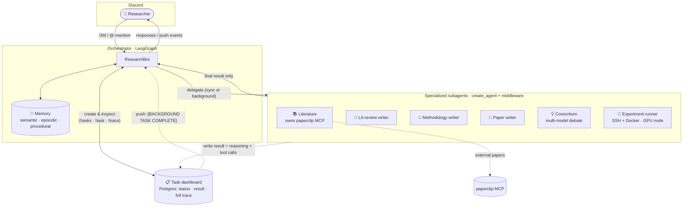

<div align="center">

# 🔬 research_agent

**A personal, autonomous research agent — explores the literature, designs and writes methodology, runs experiments, debates ideas with a multi-model panel, and helps write the paper. Reachable over Discord.**


[Why](#-why) · [What it does](#-what-it-does) · [Architecture](#-architecture) · [Commands](#-commands) · [Memory](#-memory) · [Setup](#-setup) · [Docs](#-documentation)

📚 **Docs:** https://makhanov-nu.github.io/research_agent/

</div>

---

## 🤔 Why

Research has too many moving parts to hold in one head — or one prompt. You read a
dozen papers, lose the thread, re-derive the same methodology, and the experiment
you ran last month is a folder you can't find.

A single chat agent doesn't fix this. Its context overflows, it forgets, and it
tries to do everything itself.

**research_agent solves this by being a team.** A thin orchestrator talks to you on
Discord and *delegates* to specialized subagents — each with its own context, tools,
and job. Literature search, idea generation, methodology, experiments: divide and
conquer. Everything it learns goes into durable memory, and every delegation is
recorded on a task dashboard you can inspect.

---

## 📦 What it does

| Capability | What you get |
|---|---|
| 📚 **Literature** | A research subagent owns the [paperclip](https://paperclip.gxl.ai) MCP tools and returns grounded, **cited** synthesis over papers, trials, and regulatory docs. |
| 💡 **Ideation** (`!ideate`) | A multi-model **consortium** (Claude Opus, GPT-5.5, Gemini 3 Pro, DeepSeek-R1) grounds in the literature, then debates over a shared transcript and proposes **3 Q1-level ideas**. |
| 📐 **Methodology** | Designs a rigorous methodology (research questions, baselines/ablations, metrics, protocol, threats to validity), grounded in the literature, and writes it as a LaTeX `\section{Methodology}`. |
| 📝 **LaTeX writing** | Drafts a literature review and full **paper** sections from your material, saving `.tex` / `.bib` to outputs. |
| 🧪 **Experiments** | Runs jobs on a **separate GPU node** over SSH + Docker, with human approval before each launch. |
| 🧠 **Memory** | Postgres + pgvector store organized by semantic / episodic / procedural — facts, a lab notebook, and learned preferences that persist across restarts. |
| 📋 **Task dashboard** | Every delegation is recorded with its result *and* full trace (reasoning + tool calls). |

---

## 🏗 Architecture

The Discord-facing agent is a thin **orchestrator**. Its tools *delegate* to
specialized **subagents** and receive only their final results — keeping the
orchestrator's context lean. Subagents run on LangChain v1 `create_agent`; their
full reasoning is captured separately, not pushed back up.



> **How to read it:** the orchestrator delegates self-contained jobs to subagents
> and gets back only their final result (the full reasoning/tool-call trace goes
> to the dashboard, not the orchestrator's context). Heavy jobs run in the
> background and **push** their result back when done.

- **Subagents** return only their final answer; the full trace lands in the task
  `trace` column via `TaskRecorderMiddleware`.
- **Background dispatcher** runs subagents async/parallel (semaphore-capped). When a
  task finishes it **wakes the orchestrator with an event** — push-based, no polling.
- **Provider-agnostic** — models run through OpenRouter by default (swap any
  Anthropic / OpenAI / Google / DeepSeek model via `LLM_MODEL`).

---

## 💬 Commands

| Command | What it does |
|---|---|
| `!ideate <topic>` | Convene the multi-model consortium to propose 3 Q1 ideas |
| `!tasks` / `!task <id>` / `!trace <id>` | The dashboard: recent tasks, status+result, full trace export |
| `!checkpoint` (`!summarize`) | Summarize this thread to long-term memory and reset live context |
| `!remember <text>` | Store a durable preference/instruction |
| `!getfile <path>` | Fetch a written output (e.g. a drafted LaTeX review) |
| `!runs` / `!approve <id>` / `!cancel <id>` | List / approve+launch / cancel experiments |
| `!help` | Show commands |

Otherwise, just talk to it — **DM** or **@-mention** it in a channel.

---

## 🧠 Memory

A memory subsystem on **Postgres + pgvector**, organized by the
semantic / episodic / procedural framework:

| Layer | Role |
|---|---|
| **Semantic** (facts) | [mem0](https://github.com/mem0ai/mem0) over pgvector, entity linking + provenance. Embeddings via OpenRouter (`openai/text-embedding-3-small`). |
| **Episodic** (experiences) | A Postgres "lab notebook": action log, per-channel activity, **experiment registry** (config, metrics, status, artifacts). |
| **Procedural** (instructions) | Learned preferences/procedures prepended to the prompt (`!remember`). |
| **Working memory** | Durable LangGraph Postgres checkpointer (survives restarts). |

**Token management:** rolling auto-summarization keeps live context small; a 20k-token
nudge asks whether to checkpoint; `!checkpoint` forces it. **Maintenance loop:**
archives channels idle > 7 days and runs a consolidation/reflection pass.

> Memory is optional — without `DATABASE_URL` the bot runs on in-process state.

---

## ⚙️ Setup

```bash
python -m venv .venv && source .venv/bin/activate
pip install -e ".[memory]"   # core + memory; add ".[dev]" for tests, ".[docs]" for the docs site

cp .env.example .env         # then fill in the values
docker compose up -d         # Postgres + pgvector (for memory)
```

Required in `.env`:

| Variable | Purpose |
|---|---|
| `DISCORD_TOKEN` | Your Discord bot token |
| `OPENROUTER_API_KEY` | Model access via OpenRouter (default provider) |
| `PAPERCLIP_API_KEY` | `gxl_...` key from https://paperclip.gxl.ai/keys |
| `DATABASE_URL` | Postgres connection string (enables memory; schema auto-created) |

The model is set via `LLM_MODEL` (default `anthropic/claude-sonnet-4.6`). To use the
Anthropic/OpenAI APIs directly instead of OpenRouter, set `LLM_PROVIDER=anthropic`
(+ `ANTHROPIC_API_KEY`) or `LLM_PROVIDER=openai` (+ `OPENAI_API_KEY`).

**Discord bot:** create an app at the [Developer Portal](https://discord.com/developers/applications)
→ Bot, enable the **Message Content Intent**, copy the token into `DISCORD_TOKEN`,
and invite it (OAuth2 → scope `bot`, send-messages perms).

### Run

```bash
research-agent                 # or: python -m research_agent.main   (Discord)
python -m research_agent.cli   # local terminal REPL for testing
```

### Adding MCP servers

Copy `mcp_servers.example.json` → `mcp_servers.json` and add entries. `${VAR}` is
substituted from the environment. Transports: `streamable_http`, `sse`, `stdio`.

---

## 📂 Project layout

```
src/research_agent/
  config.py          # settings via env / .env (OpenRouter default)
  llm.py             # provider-agnostic model factory + per-model clients
  prompts.py         # orchestrator system prompt + composer
  mcp_client.py      # load tools from MCP servers
  db.py              # Postgres pool + durable checkpointer
  agent/             # orchestrator graph (load_context -> agent -> tools)
  agents/            # subagents + delegation
    registry.py      #   build the orchestrator's delegated tools
    subagent.py      #   create_agent runner + subagent-tool factory
    middleware.py    #   TaskRecorderMiddleware (capture trace, return result)
    task_store.py    #   Postgres tasks table (the dashboard)
    dispatcher.py    #   async parallel dispatch + push-based completion
    literature.py    #   literature research subagent
    consortium_tool.py
  consortium/        # multi-model shared-transcript debate (!ideate)
  memory/            # manager + semantic/episodic/procedural + summarize/tokens/maintenance
  writing/           # LaTeX literature-review writer
  experiments/       # ComputeBackend + SSHDockerBackend + runner + tools
  discord_bot/bot.py # Discord client -> graph bridge, commands
  cli.py             # local terminal REPL (no Discord)
  main.py            # entrypoint: runs the Discord bot
```

---

## 📚 Documentation

Built with **Material for MkDocs** + **mkdocstrings**, auto-deployed to GitHub Pages
on every push to `main`.

```bash
pip install -e ".[docs]"
mkdocs serve     # live preview at http://127.0.0.1:8000
```

## 🧪 Tests

```bash
pip install -e ".[dev]"
pytest
```
