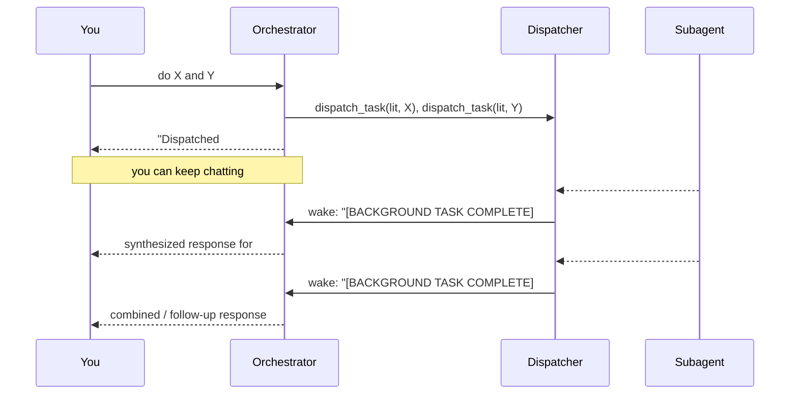

# Agents & tasks

The orchestrator coordinates **specialized subagents** and tracks every job on a
**task dashboard**. Delegation can be synchronous (inline result) or asynchronous
(background, parallel, push-on-completion).

## Subagents as delegation tools

Each subagent is wrapped as a single tool taking one self-contained `task` string
(`agents/subagent.py`). It runs a fresh `create_agent` loop with its own tools and
**middleware**, then returns only the final result. Register new subagents in
`agents/registry.py`.

Current delegation tools:

| Tool | Subagent | Returns |
| --- | --- | --- |
| `research_literature(task)` | literature (owns paperclip) | a cited synthesis |
| `draft_literature_review(...)` | LaTeX writer | a saved file path |
| `design_methodology(...)` | LaTeX methodology writer | a saved file path |
| `draft_paper(...)` | LaTeX paper writer | a saved file path |
| `brainstorm_research_ideas(...)` | [consortium](consortium.md) | 3 Q1 ideas |
| experiment tools | [experiments](experiments.md) | concise status |

The three LaTeX writers (`writing/`) share a base (`writing/latex.py`): research
the literature, return a `latex` (+ `bibtex`) block, parse, and save to disk
under `outputs/{lit_reviews,methodology,papers}/`. A natural pipeline chains them:
`research_literature → brainstorm_research_ideas → design_methodology →
experiments → draft_paper`, feeding each stage forward.

!!! tip "Adding a new agent"
    Write its system prompt, call `build_subagent_tool(...)`, register it in
    `build_delegated_tools` (and `build_runners` to make it dispatchable). No
    orchestrator changes needed.

## Middleware & trace capture

Subagents run on LangChain v1 `create_agent(model, tools, middleware=[...])`.
`TaskRecorderMiddleware` (`agents/middleware.py`) captures the full run — every
model message (reasoning + content) and every tool call/result — via the
`after_agent` hook. The orchestrator receives only the result; the full trace is
persisted for research/validation.

The same `middleware=[...]` seam supports `before_model` / `after_model` (token
accounting, trimming), `wrap_tool_call` (per-tool policy), and
`HumanInTheLoopMiddleware` (tool-approval interrupts, HITL).

## Task dashboard

Every delegation becomes a row in the Postgres `tasks` table
(`agents/task_store.py`):

| Column | Meaning |
| --- | --- |
| `agent`, `input`, `channel_id`, `parent_id` | who/what/where |
| `status` | `pending` → `running` → `done` / `failed` / `cancelled` |
| `result` | the final output |
| `trace` (JSONB) | the **whole process**: reasoning + tool calls + results |
| `created_at` / `started_at` / `finished_at` | timings |

Inspect via `!tasks` (recent), `!task <id>` (status + result), and `!trace <id>`
(export the full trace as a file).

## Async / parallel dispatch

For heavy or multiple jobs, the orchestrator dispatches to the background instead
of blocking the conversation. Completion is **push-based** — a finished task
wakes the orchestrator with its result.

- **`dispatch_task(agent, task)`** submits a job and returns immediately. Fan out
  several to run in parallel (capped by `MAX_PARALLEL_TASKS`).
- **No polling.** When a task finishes, `TaskDispatcher` fires an `on_complete`
  event; the bot runs a graph turn on the task's thread with the result injected
  as a `[BACKGROUND TASK COMPLETE]` event, and posts the orchestrator's response.
- Runs are **per-thread serialized** so completions can't race with your messages
  or each other; failures are surfaced too.

See the API in [Agents & dispatcher](reference/agents.md).
