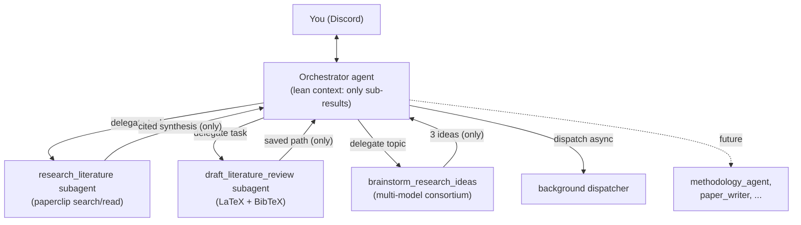
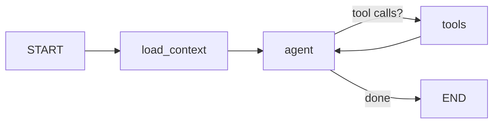

# Architecture

The system is an **orchestrator + subagents** design. The Discord-facing agent is
a thin **orchestrator** whose tools *delegate* self-contained jobs to specialized
subagents. Each subagent runs its own loop with its own tools and context, and
the orchestrator receives **only the final result** — never the intermediate
searches or reasoning. That isolation keeps the orchestrator's context (and token
cost) small and makes new capabilities easy to add.



## Principles

- **Divide and conquer.** Heavy work (many paper searches, multi-model debates)
  happens inside subagents; the orchestrator only sees concise results.
- **Delegation = tools.** A subagent is exposed to the orchestrator as a single
  tool that takes one self-contained `task` string.
- **Everything is tracked.** Every delegation is recorded on the
  [task dashboard](agents-and-tasks.md) with its result and a full trace.
- **Provider-agnostic.** Models are chosen via config; OpenRouter gives access to
  many frontier models through one key.
- **Graceful degradation.** Without a database, memory/tasks/experiments switch
  off and the bot still runs; without a compute node, experiments stay dormant.

## The orchestrator graph

A standard tool-using (ReAct) loop with a memory pre-step:



- **`load_context`** rolls older messages into a summary when context grows,
  recalls relevant facts + learned procedures, and raises the 20k-token
  checkpoint nudge. See [Memory](memory.md).
- **`agent`** is the orchestrator LLM bound to the delegation tools.
- **`tools`** runs the delegation tools (each a subagent) — concurrently when the
  model emits several at once.

## Subagents

Subagents are built on LangChain v1 `create_agent` with **middleware**. A
`TaskRecorderMiddleware` captures the whole run (reasoning + tool calls +
results) for the task trace; the delegation wrapper returns only the final text.
This is also the seam for `before_model` / `after_model` hooks and
`HumanInTheLoopMiddleware` (tool approval).

See [Agents & tasks](agents-and-tasks.md) for delegation, the task dashboard, and
the async/parallel dispatcher.

## Repository layout

```
src/research_agent/
  config.py            # settings (env / .env)
  llm.py               # provider-agnostic model factory (+ OpenRouter helper)
  prompts.py           # orchestrator system prompt + composer
  mcp_client.py        # load tools from MCP servers
  db.py                # Postgres pool + durable checkpointer
  agent/               # the orchestrator graph (load_context -> agent -> tools)
  agents/              # subagents, delegation tools, task store, dispatcher, middleware
  memory/              # semantic / episodic / procedural + summarization + maintenance
  consortium/          # multi-model shared-session ideation
  experiments/         # experiment runner (SSH+Docker backend, registry, tools)
  writing/             # LaTeX literature-review writer
  discord_bot/         # Discord client, commands, notifications
  main.py / cli.py     # entrypoints
```
