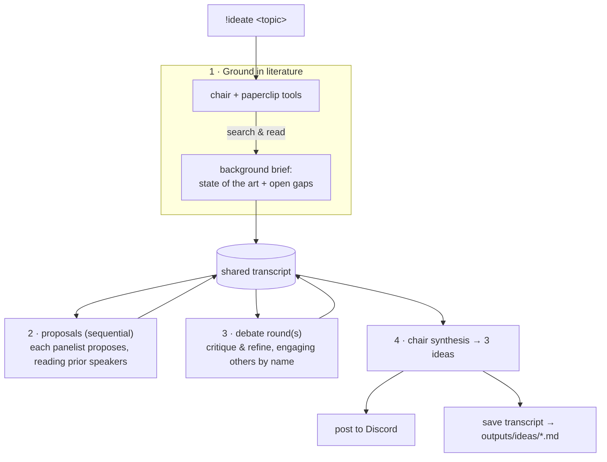

# Consortium

The consortium is a **multi-model shared-session debate**. Several frontier models
(via OpenRouter) discuss in **one shared transcript** — each reads the running
discussion before it speaks, so they hear and react to each other — then a chair
synthesizes a few **Q1-level research ideas**, grounded in the literature.

Invoke it with `!ideate <topic>`, or let the orchestrator delegate to it
(`brainstorm_research_ideas`).

## Flow

## Shared memory

The "shared memory" is the **transcript**: every model call is sent the entire
discussion-so-far, and each model is prompted to engage the others by name. This
is what gives the one-session, hear-each-other behavior. Proposals run
sequentially so later speakers see earlier ones; debate rounds let them argue;
the chair synthesizes over the whole conversation.

## Configuration

| Variable | Default | Meaning |
| --- | --- | --- |
| `CONSORTIUM_MODELS` | Opus 4.7, GPT-5.5, Gemini 3 Pro, DeepSeek-R1 | panel (comma-separated OpenRouter slugs) |
| `CONSORTIUM_CHAIR_MODEL` | `anthropic/claude-opus-4.7` | synthesizer |
| `CONSORTIUM_ROUNDS` | `1` | debate rounds after proposals |
| `CONSORTIUM_TEMPERATURE` | `0.6` | panel creativity |

!!! warning "Cost & latency"
    `!ideate` makes many frontier-model calls in sequence (grounding + proposals +
    debate + synthesis), so expect a few minutes and real token spend per run.

The 3 ideas are posted to Discord; the full shared-session transcript is saved
and retrievable via `!getfile ideas/<file>.md`.

See the API in [Consortium reference](reference/consortium.md).
