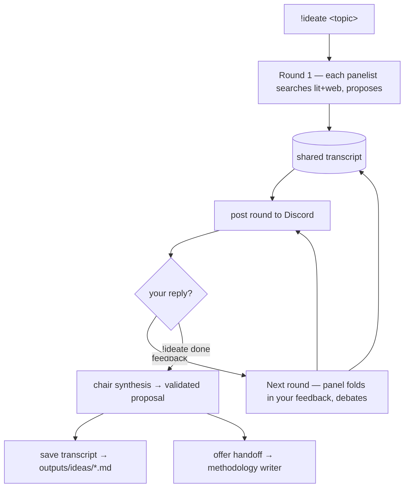

# Consortium

The consortium is a **multi-model shared-session debate** you steer. Several
frontier models (via OpenRouter) argue in **one shared transcript** — each is a
**tool-using agent** that searches the literature (paperclip) and the **web
(Tavily)** before speaking, and reads the running discussion so they hear and
react to each other by name. You weigh in between rounds; a chair then synthesizes
a **validated research proposal** (problem, novelty, theoretical justification +
formulae, what/where/why to improve, experiments, risks, venue).

Run it as an interactive session with `!ideate`, or let the orchestrator delegate
a non-interactive run (`brainstorm_research_ideas`).

## Interactive session

- `!ideate <topic>` opens a session and posts round 1.
- **Reply with your opinion** to run another round (the panel addresses your
  feedback directly); `!ideate done` finalizes; `!ideate cancel` drops it.
- While a session is live in a channel, your plain messages are treated as
  feedback (not normal orchestrator chat).

## Shared memory

The "shared memory" is the **transcript**: every agent call is sent the entire
discussion-so-far (including your feedback), and each is prompted to engage the
others by name. Panelists run sequentially so later speakers see earlier ones;
the chair synthesizes over the whole conversation. Because each panelist has the
paperclip + Tavily tools, they verify novelty/SOTA themselves rather than guess.

## Configuration

| Variable | Default | Meaning |
| --- | --- | --- |
| `CONSORTIUM_MODELS` | Opus 4.7, GPT-5.5, Gemini 3 Pro, DeepSeek-R1 | panel (comma-separated OpenRouter slugs) |
| `CONSORTIUM_CHAIR_MODEL` | `anthropic/claude-opus-4.7` | synthesizer |
| `CONSORTIUM_ROUNDS` | `1` | debate rounds after proposals |
| `CONSORTIUM_TEMPERATURE` | `0.6` | panel creativity |

Web search needs `TAVILY_API_KEY` (Tavily's hosted MCP server); without it the
panel still runs on paperclip alone.

!!! warning "Cost & latency"
    Each round is several tool-using frontier-model agents in sequence (each
    searching lit+web), so expect a few minutes and real token spend per round.

The validated proposal is posted to Discord; the full shared-session transcript
is saved and retrievable via `!getfile ideas/<file>.md`.

See the API in [Consortium reference](reference/consortium.md).
