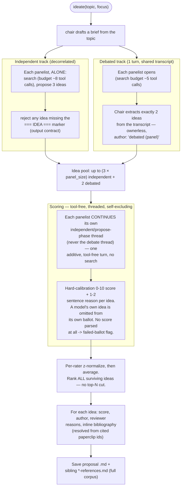

# Consortium

The consortium is a **two-track scored ideation panel** run as a single round.
Several frontier reasoning models (via OpenRouter) generate research ideas two
ways, everyone scores everything, and every idea that survives is returned —
ranked, with its author, why each reviewer scored it that way, and a
bibliography. There's no chair-synthesized "final proposal" and no
multi-round polish/vote loop; one round produces the full ranked slate.

Run it via `!ideate <topic>` in Discord, or let the orchestrator delegate a
non-interactive run (`brainstorm_research_ideas`) — both call the same
`Consortium.ideate(...)`.

## The single round

- **Independent track** — each panelist works alone from the brief (no shared
  context), so its errors stay decorrelated from the others.
- **Debated track** — capped at one turn (no back-and-forth), then the chair
  extracts the two strongest, genuinely distinct ideas that emerged. These are
  ownerless syntheses, shown as `author: debated (panel)`.
- **Scoring** is the part most worth understanding: a panelist doesn't get a
  fresh, memory-less scoring prompt — it continues the *same conversation* it
  used to research and write its own independent ideas, and judges from there.
  That's deliberate: a model that argued for a debated idea is invested in it,
  so scoring is never done from the debate thread. The call is tool-free
  (no search), so it's a single additive turn with no recursion-limit
  exposure. A model's own independent idea(s) never appear on its own ballot.
- **No top-N cut.** Every idea that produced a valid `=== IDEA ===` block is
  scored and returned, ranked by the cross-rater normalized score.
- **References** are written twice: inline per idea (a `Bibliography:`
  section resolved from the paperclip ids the idea cites) and as a standalone
  `*-references.md` file with the full deduped corpus the session retrieved.

## Discord usage

`!ideate <topic>` runs the round and posts the result directly — there's no
`pick`/`again`/`done` follow-up. While a run is in flight in a thread/conversation,
another `!ideate` in that same thread is rejected ("the panel is still
deliberating") rather than queued.

## Configuration

| Variable | Default | Meaning |
| --- | --- | --- |
| `CONSORTIUM_MODELS` | `deepseek/deepseek-v4-pro,z-ai/glm-5.1,qwen/qwen3.7-plus,moonshotai/kimi-k2.6` | panel (comma-separated OpenRouter slugs) |
| `CONSORTIUM_CHAIR_MODEL` | `deepseek/deepseek-r1` | drafts the brief, extracts the 2 debated ideas |
| `CONSORTIUM_TEMPERATURE` | `0.6` | panel creativity |
| `CONSORTIUM_DEBATE_TURNS` | `1` | turns in the shared debate before chair extraction |

Web search needs `TAVILY_API_KEY` (Tavily's hosted MCP server); literature
search needs `PAPERCLIP_API_KEY`. Without Tavily the panel runs on paperclip
alone; without either, panelists propose from model knowledge only (and the
bibliography has nothing to resolve against).

!!! warning "Cost & latency"
    Propose and debate are tool-using frontier-model agents (each searching
    literature, within its stated per-phase budget), so expect a few minutes
    and real token spend per run. Scoring is comparatively cheap: one
    additive, tool-free turn per panelist.

The proposal document and the references file are both saved under
`outputs/ideas/` and retrievable via `!getfile ideas/<file>.md`.

See the API in [Consortium reference](reference/consortium.md).
