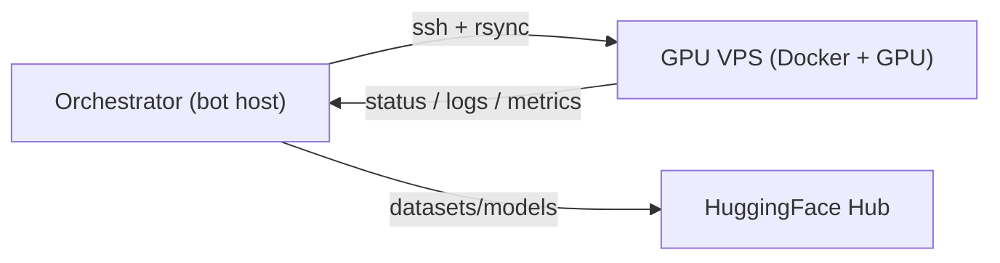

# Experiments

The experiment runner lets the agent **run experiments on a separate GPU node**,
dispatched over SSH + Docker, and tracked in the experiment registry. It is
dormant until a compute node is configured (`COMPUTE_SSH_HOST` / `COMPUTE_SSH_USER`).

For the full design — backend abstraction, job lifecycle, safety, and the phased
plan — see [Experiment runner (design)](experiment-runner.md).

## Topology

The bot host is the always-on **orchestrator**; heavy compute runs on the GPU
node. The agent generates code, dispatches it, tracks it, and reports — it does
not run training locally.

## Workflow

1. **propose** an experiment (registry row).
2. **write code** into a workspace (`write_experiment_code`).
3. **request launch** — gated by human approval (`!approve <id>`).
4. the **`SSHDockerBackend`** rsyncs the workspace, runs a detached container
   (secrets via a remote `--env-file`), and records the handle.
5. a **poller** checks active runs and reports completions to Discord; metrics
   are read from `/output/metrics.jsonl` and artifacts fetched back.

## Configuration

| Variable | Meaning |
| --- | --- |
| `COMPUTE_SSH_HOST` / `COMPUTE_SSH_USER` | GPU node SSH target (runner off when empty) |
| `COMPUTE_SSH_PORT` / `COMPUTE_SSH_KEY` | SSH port / key path |
| `COMPUTE_WORKDIR` | remote dir for per-experiment workspaces/outputs |
| `COMPUTE_BASE_IMAGE` | default container image |
| `COMPUTE_DEFAULT_GPUS` | docker `--gpus` value |
| `EXPERIMENT_REQUIRE_APPROVAL` | require `!approve` before launch |
| `JOB_POLL_INTERVAL_SECONDS` | how often the poller checks |

## Commands

`!runs` · `!approve <id>` · `!cancel <id>` — see [Discord commands](commands.md).

See the API in [Experiments reference](reference/experiments.md).
