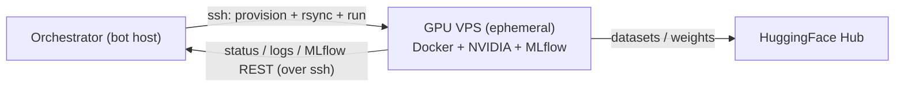

# Experiments

The experiment runner lets the agent **run experiments on a GPU node**,
dispatched over SSH + Docker and tracked in the experiment registry + MLflow.

The GPU box is **ephemeral**: a fresh, bare-Ubuntu VPS is attached per experiment
with `!gpu <user@ip>` (reachable with the bot's SSH key). On attach the runner
**provisions** it — installs Docker + the NVIDIA Container Toolkit, runs a
GPU-in-container smoke test, and starts an MLflow server — so nothing needs to be
pre-installed. Each experiment records the box it ran on, so status/logs/poll keep
hitting the right host even after a new box is attached.

For the full design — backend abstraction, job lifecycle, safety — see
[Experiment runner (design)](experiment-runner.md).

## Topology

The bot host is the always-on **orchestrator**; heavy compute runs on the GPU
node. The agent generates code, dispatches it, tracks it, and reports — it does
not run training locally.

## Workflow

1. **attach a GPU box** — `!gpu <user@ip>`; auto-provisioned (Docker + NVIDIA
   toolkit + MLflow).
2. **propose** an experiment (registry row).
3. **author code** — `author_experiment_code(spec)`: the **Codex coder**
   (`EXPERIMENT_CODER_MODEL`, default `openai/gpt-5.5`) writes a runnable
   `train.py` with **Optuna** HPO, **HuggingFace** data loading, and **MLflow**
   logging, plus `requirements.txt`. (Or hand-write via `write_experiment_code`.)
4. **request launch** — gated by human approval (`!approve <id>`).
5. the **`SSHDockerBackend`** rsyncs the workspace, runs a detached container
   (joined to the MLflow network, persistent HF cache volume, secrets via a remote
   `--env-file`), and records the handle.
6. a **poller** checks active runs and reports completions to Discord; metrics are
   read from `/output/metrics.jsonl` (and on demand from MLflow via
   `experiment_mlflow` / the REST API tunnelled over SSH); artifacts are fetched
   back.

## Configuration

A preset host is optional — boxes are usually attached at runtime via `!gpu`.

| Variable | Meaning |
| --- | --- |
| `COMPUTE_SSH_HOST` / `COMPUTE_SSH_USER` | optional preset GPU target (usually set via `!gpu`) |
| `COMPUTE_SSH_PORT` / `COMPUTE_SSH_KEY` | SSH port / key path |
| `COMPUTE_WORKDIR` | remote dir for per-experiment workspaces/outputs |
| `COMPUTE_BASE_IMAGE` | default container image |
| `COMPUTE_DEFAULT_GPUS` | docker `--gpus` value |
| `COMPUTE_NETWORK` / `COMPUTE_HF_CACHE_VOLUME` | shared MLflow network / persistent HF cache volume |
| `EXPERIMENT_CODER_MODEL` | OpenRouter slug for the Codex coder (default `openai/gpt-5.5`) |
| `HF_TOKEN` | HuggingFace token passed into jobs (env-file) |
| `MLFLOW_ENABLED` / `MLFLOW_IMAGE` / `MLFLOW_PORT` | MLflow tracking server on the GPU box |
| `EXPERIMENT_REQUIRE_APPROVAL` | require `!approve` before launch |
| `JOB_POLL_INTERVAL_SECONDS` | how often the poller checks |

## Commands

`!gpu <user@ip>` · `!runs` · `!approve <id>` · `!cancel <id>` — see
[Discord commands](commands.md).

See the API in [Experiments reference](reference/experiments.md).
