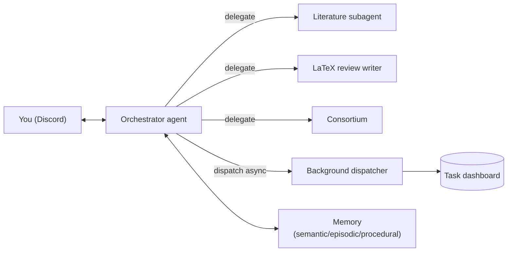

# Research Agent

A personal, **autonomous, agentic research partner** that lives on a server and
talks to you over Discord. It explores the literature, discusses and drafts
methodology, brainstorms ideas across multiple frontier models, runs experiments,
and remembers what you're working on — delegating specialized jobs to subagents
so its own context stays lean.

## What it does today

- :material-book-search: **Literature**
  Searches and reads full-text papers (via the [paperclip](https://paperclip.gxl.ai)
  MCP server) and returns cited syntheses; drafts LaTeX **Related Work** sections.

- :material-brain: **Memory**
  Semantic / episodic / procedural memory on Postgres + pgvector, with rolling
  summarization and idle archival. See [Memory](memory.md).

- :material-account-group: **Consortium**
  A multi-model **shared-session debate** (`!ideate`) that converges on Q1-level
  research ideas. See [Consortium](consortium.md).

- :material-sitemap: **Orchestrator + subagents**
  A thin orchestrator delegates to specialized subagents and tracks every job on
  a task dashboard with full traces. See [Agents & tasks](agents-and-tasks.md).

- :material-flask: **Experiments**
  Dispatches experiments to a separate GPU node over SSH + Docker, tracked in an
  experiment registry. See [Experiments](experiments.md).

## How it's built

- **Orchestration:** [LangGraph](https://langchain-ai.github.io/langgraph/) +
  LangChain v1 `create_agent` with middleware.
- **Models:** provider-agnostic; defaults to **Claude Sonnet 4.6 via OpenRouter**.
- **Tools:** sourced from **MCP servers** (pluggable) and specialized subagents.
- **Memory & state:** **Postgres + pgvector** (mem0 for semantic memory; durable
  LangGraph checkpointer).
- **Interface:** a **Discord** bot, deployed under systemd on a VPS.

Start with [Getting started](getting-started.md), or read the
[Architecture](architecture.md) to understand the design.
