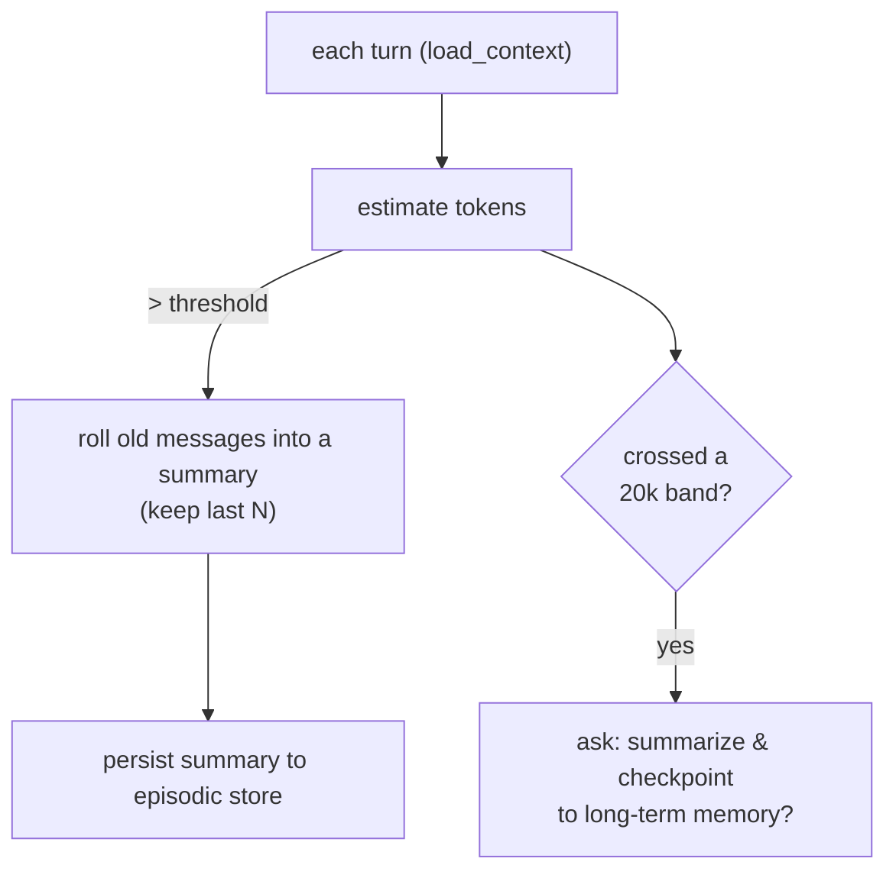

# Memory

Memory is organized around the **semantic / episodic / procedural** framework,
backed by **Postgres + pgvector**. It is optional: without `DATABASE_URL` the bot
runs on in-process state.

| Type | Stores | Backing | Module |
| --- | --- | --- | --- |
| **Semantic** | Facts (about you, projects, findings) | mem0 / pgvector | `memory/semantic.py` |
| **Episodic** | Experiences (actions, conversation summaries, experiments) | Postgres tables | `memory/episodic.py` |
| **Procedural** | Instructions (learned preferences/procedures) | Postgres | `memory/procedural.py` |

Each is fronted by a single [`MemoryManager`](reference/memory.md).

## Semantic memory

Durable facts are stored with **citation/provenance** (`source` + `as_of`) so
recalled claims stay verifiable. mem0's built-in entity linking gives lightweight
graph structure with no extra service. Retrieval is by relevance each turn.

!!! info "Embeddings"
    mem0 needs an embedder separate from the chat model. When `LLM_PROVIDER` is
    `openrouter`, embeddings route through OpenRouter's OpenAI-compatible endpoint
    (`openai/text-embedding-3-small`, 1536-dim) using `OPENROUTER_API_KEY`.

## Episodic memory

A Postgres "lab notebook": an action log, per-channel activity + rolling summary +
archive state, and the **experiment registry**.

## Procedural memory

Learned preferences and reusable procedures, prepended to the system prompt.
Add one with `!remember <text>`.

## Context management

- **Rolling summarization** keeps the live context small (configurable via
  `SUMMARY_KEEP_LAST` / `SUMMARY_TOKEN_THRESHOLD`).
- **20k-token nudge** (`NUDGE_EVERY_TOKENS`): each time the conversation crosses a
  band, the agent offers to checkpoint to long-term memory. `!checkpoint` forces
  it.

## Maintenance loop

A background pass (`memory/maintenance.py`, every `MAINTENANCE_INTERVAL_SECONDS`):

- **Idle archival** — channels with no activity for `ARCHIVE_IDLE_DAYS` are
  summarized into long-term memory and archived.
- **Consolidation / reflection** — recent episodic activity is distilled into
  durable semantic insights.

## Commands

`!remember <text>` · `!checkpoint` (or `!summarize`) — see [Discord commands](commands.md).
